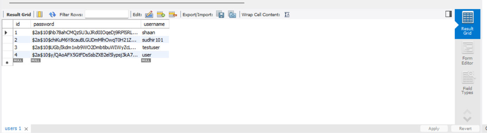
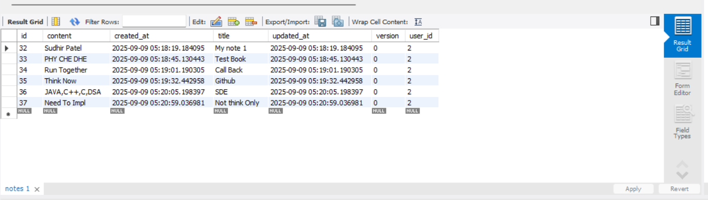

# Notes CRUD Application

A secure RESTful API for managing notes, built with Spring Boot and Spring Security.

# User DB


# Notes DB


## Features

- User authentication and authorization
- JWT-based authentication
- CRUD operations for notes
- H2 in-memory database
- Exception handling
- Input validation

## Prerequisites

- Java 21 or higher
- Maven 3.6.0 or higher
- H2 Database (in-memory)

## Tech Stack

- **Backend Framework**: Spring Boot 3.5.5
- **Security**: Spring Security with JWT
- **Database**: H2 (in-memory)
- **Build Tool**: Maven
- **Java Version**: 21

## Getting Started

### 1. Clone the Repository

```bash
git clone <repository-url>
cd notes_crud
```

### 2. Build the Application

```bash
mvn clean install
```

### 3. Run the Application

```bash
mvn spring-boot:run
```

The application will start on `http://localhost:8080`

## API Documentation

### Authentication

#### Register a new user
```
POST /api/auth/register
Content-Type: application/json

{
    "username": "user@example.com",
    "password": "password123"
}
```

#### Login
```
POST /api/auth/login
Content-Type: application/json

{
    "username": "user@example.com",
    "password": "password123"
}
```

### Notes Endpoints

#### Get All Notes
```
GET /api/notes
Authorization: Bearer <token>
```

#### Get Note by ID
```
GET /api/notes/{id}
Authorization: Bearer <token>
```

#### Create a Note
```
POST /api/notes
Authorization: Bearer <token>
Content-Type: application/json

{
    "title": "My Note",
    "content": "This is a sample note"
}
```

#### Update a Note
```
PUT /api/notes/{id}
Authorization: Bearer <token>
Content-Type: application/json

{
    "title": "Updated Note",
    "content": "This note has been updated"
}
```

#### Delete a Note
```
DELETE /api/notes/{id}
Authorization: Bearer <token>
```

## Database

The application uses H2 in-memory database by default. You can access the H2 console at:
- URL: `http://localhost:8080/h2-console`
- JDBC URL: `jdbc:h2:mem:notesdb`
- Username: `sa`
- Password: (leave empty)

## Security

- JWT (JSON Web Tokens) for authentication
- Password encryption using BCrypt
- Role-based authorization
- CSRF protection
- Input validation

## Error Handling

The API returns appropriate HTTP status codes and error messages in the following format:

```json
{
    "timestamp": "2023-09-09T05:30:00.000+00:00",
    "status": 404,
    "error": "Not Found",
    "message": "Note not found with id: 1",
    "path": "/api/notes/1"
}
```

## Contributing

1. Fork the repository
2. Create your feature branch (`git checkout -b feature/AmazingFeature`)
3. Commit your changes (`git commit -m 'Add some AmazingFeature'`)
4. Push to the branch (`git push origin feature/AmazingFeature`)
5. Open a Pull Request

## License

This project is licensed under the MIT License - see the [LICENSE](LICENSE) file for details.
